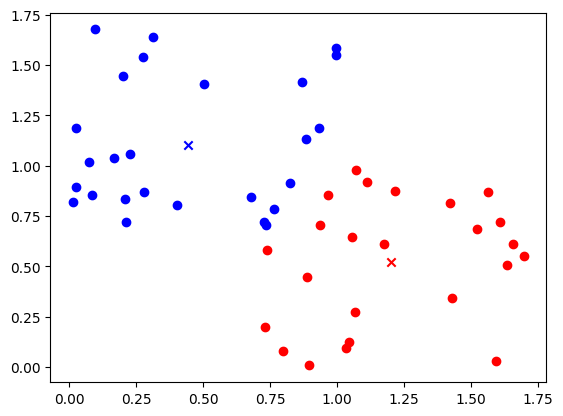

# linear-regression

A collection of machine learning models implemented with python and numpy

***

## linreg_simple
A simple Implementation of Univariate Linear Regression with batch gradient descent using mean squared error as the cost function.

## linreg_multi
A Multiple Linear Regression model with vectorization using numpy.

---

## logreg
A Logistic Regression Model with vectorization and regularization of paramters

---

## k_means
A Unsupervised clustering algorithm that groups together data points by their proximity

## Anomaly Detection
Unsupervised algorithm that fits gaussian parameters onto the training data, and predicts anomalies if the probability of new data points is below a certain threshold 'epsilon'

